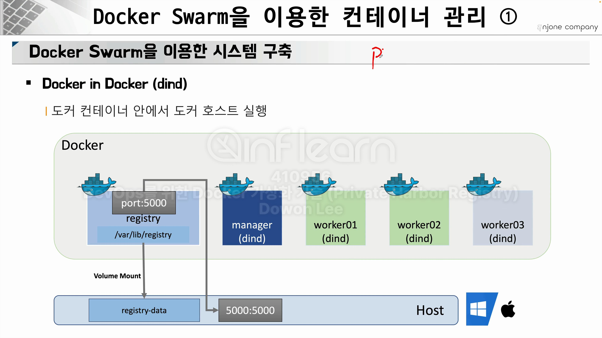
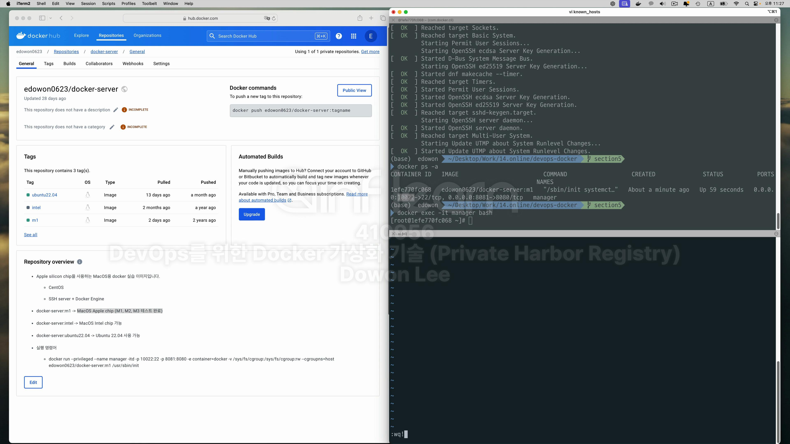
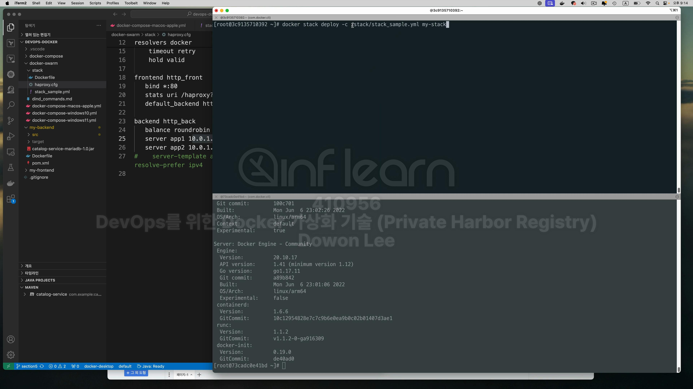
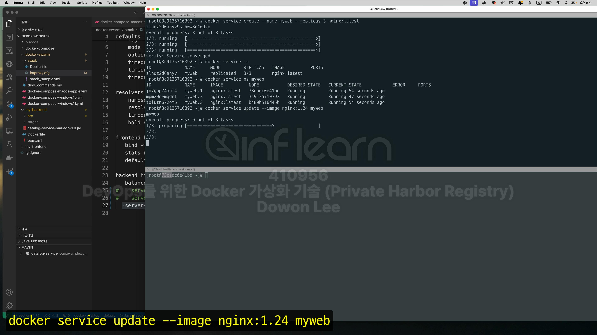

cncf를 들어가보자.

이번에 살펴볼 파트

쿠버네티스가 짱인데 이번엔 swarm을 써보자. <br>

그 이유는 docker-desktop만 사용한 상태에서 사용할 수 있고 훨씬 가볍기 때문인다. <br>


 


<br>
코드로 한번 알아보자. dind이미지를 제공받아서 실습을 진행해보자. <br>


```shell
docker run --privileged --name manager -itd -p 10022:22 -p 8081:8080 -e container=docker 
-v /sys/fs/cgroup:/sys/fs/cgroup:rw --cgroupns=host edowon0623/docker-server:m1 /usr/sbin/init
```

실행된것을 확인하고 log를 확인해보자. <br>

접속을 해보자. <br>
```shell
docker exec -it manager bash
```
그런데 이 방법 말고 ssh를 이용해서 접속할 수도 있다. 
```shell
ssh root@127.0.0.1 --port 10022
```

그런데 만약 처음 이 명령어를 실행했다고하면 저런 에러가 난다. <br>
이 오류는 ssh로 특정한 host에 접근을 시도했을 때 내 pc는 이러한 ssh의 접속 이력을 기록하게 되는데 이전에 접속했던 이력과 지금 접속하려는 기록 이력이 같은 <br>
hostname임에도 불구하고 달라서 오류가 발생한 것이다. 이럴땐 로그를 보면 .ssh라는 폴더의 위치가 표시 돼 있을텐데 해당하는 위치에 가서 known_hosts라는 <br>
파일을 삭제해 주면 된다. <br>


여기서 d를 연타하면 한줄씩 삭제가 된다.
:wq!로 저장 <br>



패스워드는 <br>
```shell
P@ssw0rd
```
이다. <br>

known_hosts가 변했다. <br>

접속한 상태에서 도커가 실행되고 있는지 확인하자. <br>
```shell
docker version
```

Cannot connect to the Docker daemon~이라고 뜬다 이것은 docker server가 기동되지 않은것!. <br>
```shell
systemctl enable docker
systemctl start docker
systemctl status docker
```
를 실행해주자.

이제 다시 docker version을 실행시키면 client와 서버가 잘 보인다. <br>


```shell
docker swarm init
```

docker swarm join ~~ 문구가 뜨는것을 보면 worker모드에서 swarm모드에 추가하기 위해선 Join 명령어를 쓰라고 뜸. <br>
docker swarm에서 join 명령어를 쓸 수 있도록 worker 노드를 2개 기동해보자. <br>

```shell
docker run --privileged --name worker1 -itd -p 20022:22 -p 8082:8080 -e container=docker 
-v /sys/fs/cgroup:/sys/fs/cgroup:rw --cgroupns=host edowon0623/docker-server:m1 /usr/sbin/init
```

```shell
docker run --privileged --name worker2 -itd -p 30022:22 -p 8083:8080 -e container=docker 
-v /sys/fs/cgroup:/sys/fs/cgroup:rw --cgroupns=host edowon0623/docker-server:m1 /usr/sbin/init
```


총 3개의 컨테이너가 기동되고 있다. <br>

```shell
ssh root@127.0.0.1 -p 20022
```

잊지말고 docker version 후 server가 안켜져있으면 위에서 실행한 3개의 명령어를 실행시켜 docker server를 구동시켜 준다.
worker2에도 같은 작업 반복
```shell
ssh root@127.0.0.1 -p 30022
```
manager container에서 처음 표시된 코드를 복사한다. 
```shell
docker swarm join --token [SWMTKN~ TOKEN ID] 172.17.0.2:2377
```
이 명령어를 까먹었다면 
```shell
docker swarm join-token worker
```
이걸 실행시키면 다시 보인다. 


Leader라고 나와있는게 manager이다. <br>


docker stack을 사용해보자. <br>
그전에 clear라는 command를 사용할 수 있게 설치해보자. 
```shell
yum install ncurses -y
```

일단 3개의 container가 모두 깨끗한 상태에서 시작하자. 

일단 stack의 명령어의 위치를 찾아보자. <br>

root디렉토리에 stack이라는 directory가 있는지 확인해 봤더니 없다. <br>

일단 종료하고 stack이라는 코드가 어떻게 생겼는지 확인해보고 지금 실행하려는 컨테이너와 volume mount를 통해 <br>
실행시키거나 파일을 복사하는 작업을 해보자. <br>
section5에 docker-swarm/stack/stack_sample.yml을 통해서 실행시켜보자. <br>

```shell
version: '3.7'

services:
  nginx:
  #nginx라는 이미지라는것을 의미한다.
    image: nginx
    deploy:  
    # 2개의 container를 실행시키겠다는 것을 의미한다.
      replicas: 2
      placement:
      # 워커노드에만 배포하겠다는 것을 의미한다.
        constraints: [node.role == worker]
      restart_policy:
        condition: on-failure
        max_attempts: 2
    ports: # attach on ingress network 1
      - "8088:80"
    environment:
      SERVICE_PORTS: 80
    networks:
    #네트워크 정보를 표시해 놓았다.
      - my-overlay-network

  proxy:
    # image: dockercloud/haproxy
    # haproxy라는것을 설치하는데 이게 왜 중요하냐면, 지금 설치하고 있는 nginx라는 서비스 자체가 2개(replicas)이상 
    # 만들어졌다고하면, 2개의 nginx가 같은 역할을 하긴 하지만 사용자 입장에서는 nginx를 구분하지 않고 Nginx라는 서비스에 접속해서
    # 적절한 결과만 받으면 되는데, 1번으로 갈지 2번으로 갈지 또 1번이 망가졌을 때 2번으로 가기위한 설정을 위해 proxy가 필요하다.
    # 즉 게이트웨이 역할을 한다.
    image: haproxy:latest
    depends_on:
      - nginx
    volumes: 
      - /var/run/docker.sock:/var/run/docker.sock
      - /stack/haproxy.cfg:/usr/local/etc/haproxy/haproxy.cfg:ro
    ports: # attach on ingress network 1
      - "80:80"
    networks: # attach on web network 2 - nginx connect
      - my-overlay-network
    deploy:
      mode: global
      placement:
        constraints: [node.role == manager]

networks: 
#그리고 마지막으로 network도 swarm에서 사용할 수 있도록 overlay-network로 만들어야 한다.
  my-overlay-network: 
    external: true

```
services항목에 nginx라던가 proxy등의 이미지들이 있다. <br>
이제 overlay network를 만들고 stack을 volume mount를 통해서 stack을 실행하는 작업을 해보자. <br>
```shell
#### Apple m1 chip

$ docker run --privileged --name manager -itd -p 10022:22 -p 8081:8080 -e container=docker -v /sys/fs/cgroup:/sys/fs/cgroup:rw --cgroupns=host edowon0623/docker-server:m1 /usr/sbin/init

$ docker run --privileged --name worker01 -itd -p 20022:22 -p 8082:8080 -e container=docker -v /sys/fs/cgroup:/sys/fs/cgroup:rw --cgroupns=host edowon0623/docker-server:m1 /usr/sbin/init

$ docker run --privileged --name worker02 -itd -p 30022:22 -p 8083:8080 -e container=docker -v /sys/fs/cgroup:/sys/fs/cgroup:rw --cgroupns=host edowon0623/docker-server:m1 /usr/sbin/init
````
앞에 command를 실행하기 위해 docker-swarm/dind_commands.md 파일에 위 처럼 명령어들이 있다. <br>
그리고 또 docker-compose-macos-apple.yml
```shell
version: "3.7"
services: 
  # registry:
  #   container_name: registry
  #   image: registry:latest
  #   ports: 
  #     - 5000:5000
  #   volumes: 
  #     - "./registry-data:/var/lib/registry"

  manager:
    container_name: manager
    image: edowon0623/docker-server:m1
    privileged: true
    tty: true
    ports:
      - 8000:80
      - 9000:9000
    # depends_on: 
    #   - registry
    expose: 
      - 3375
    command: "--insecure-registry registry:5000"
    environment:
      - container=docker
    volumes: 
      - "./stack:/stack"
      - /sys/fs/cgroup:/sys/fs/cgroup:rw
    cgroup: host

  worker1:
    container_name: worker1
    image: edowon0623/docker-server:m1
    privileged: true
    tty: true
    depends_on: 
      - manager
      # - registry
    expose: 
      - 7946
      - 7946/udp
      - 4789/udp
    command: "--insecure-registry registry:5000"
    environment:
      - container=docker
    volumes: 
      - /sys/fs/cgroup:/sys/fs/cgroup:rw
    cgroup: host

  worker2:
    container_name: worker2
    image: edowon0623/docker-server:m1
    privileged: true
    tty: true
    depends_on: 
      - manager
      # - registry
    expose: 
      - 7946
      - 7946/udp
      - 4789/udp
    command: "--insecure-registry registry:5000"
    environment:
      - container=docker
    volumes: 
      - /sys/fs/cgroup:/sys/fs/cgroup:rw
    cgroup: host

```
파일이 있다. 이놈은 아까 위에서 작업한 dind image 3개를 간단하게 작업하기 위한 docker-compose파일이다. <br>
실습에 들어가기 앞서 현재 컨테이너 상태를 확인하자. <br>


```shell
docker node ls
```
명령어를 입력할 때 저렇게 나오면 정상 상태이다. 그런데 만약 저런 상태가 안나오고 node들의 상태정보가 표시 된다면 그건 docker-swarm이 <br>
실행되는 상태라는 것이다. 그럴땐 각각의 자식 node들로 가서 
```shell
docker swarm leave
```
명령어를 통해 docker swarm을 내리고 마지막으로 manager node에서 
```shell
docker swarm leave --force
```
를 통해서 매니저 노드를 종료시키자. <br>
그리고 exit으로 탈출한 후 컨테이너들을 종료시키자. <br>

굳이 종료를 하는 이유는 Docker-compose를 이용하기 때문<br>
rm도 시키자.

docker-compose가 있는 위치로 이동한다. <br>


network와 함께 3가지 container가 기동 됐다. <br>
```shell
docker-compose -f docker-compose-macos-apple.yml ps
```


3가지 컨테이너가 정상 작동된 것을 확인할 수 있다. <br>

기존의 방식처럼 저렇게 하나씩 3개를 실행하는것보다. docker-compose방식을 사용해서 한번에 기동시키는것이 효율적이다. <br>
이제 앞서 수작업으로 docker-swarm cluster를 구성한다고 했을 때 manager, worker1, worker2에 각각 swarm-cluser구축하고 join하는 작업을 해보자. <br>

접속을 하려고 하는데 접속이 허용되지 않는다. <br>
이건 10022 port를 열어놓지 않았기 때문이다. 이렇게 접속을 할거라면 

이런식으로 10022:22 설정을 추가로 넣어줬어야한다. 그런데 넣어주지 않은 상태이기 때문에 이걸 추가하고 재기동 시키면 되지만 이번엔 다른 방법을 써보겠다. <br>
```shell
docker exec -it manager bash
```

docker version을 통해 docker client, server가 잘 기동 돼었는지 확인해보자. <br>

서버가 기동되지 않았다. <br>
```shell
systemctl start docker 
systemctl status docker
```

매니저 노드 뿐만아니라 worker노드 두군데에서도 docker를 기동해주자. <br>


이제 docker-swarm cluster를 구축해보자. <br>

```shell
docker-swarm init
```
이 메서드를 통해서 초기화를 진행한다. <br>

명령어를 실행하면 join에 필요한 명령어르 받을 수 있다. <br>

worker노드에서 해당하는 명령어르 그대로 입력하면 <br>

node가 join됐다는 것을 받을 수 있다. <br>
worker2에도 실행시킨다. <br>
그리고 현재 상태를 확인하면된다. <br>
```shell
docker node ls
```

이제 docker-stack을 사용하기 위해선 overlaynetwork를 생성해야하는데 이 작업은 manager에서 작업하면 된다. <br>
현재 manager docker에 network 목록을 확인해보면, <br>

이런 정보들을 확인할 수 있다. 여기에다가 추가로 overlay-network를 하나 더 생성해보겠다. <br>
기본적으로 overlay-network가 swarm network를 만들게 되면 기본적으로 ingress라는 이름을 만든다. <br>
그런데 우리는 my-overlay-network라는 이름으로 만들겠다. <br>
```shell
docker network create --driver overlay my-overlay-network
```


그러면 이제 stack_sample.yml이라는 파일을 기동시킬 수 있다.
이 파일은 어디 있을까? 이건 아까 docker-compose를 기동할 때 파일을 보면 된다. <br>

volume 부분을 보면 "./stack:/stack" -> 이건 실행 시켰던 host pc의 stack이라는 폴더를 container 내부의 root 디렉토리의 stack으로 옮긴것이다. <br>
그렇기 때문에 /stack이 컨테이너에 들어와 있는것을 확인할 수 있다. <br>

그럼 이제 stack을 배포해보자. <br>
```shell
docker stack deploy -c /stack/stack_sample.yml my-stack
```
stack_sample.yml을 살펴보자. <br>
```yml
version: '3.7'

services:
  nginx:
    image: nginx
    deploy:  
      replicas: 2
      placement:
        constraints: [node.role == worker]
      restart_policy:
        condition: on-failure
        max_attempts: 2
    ports: # attach on ingress network 1
      - "8088:80"
    environment: 
      SERVICE_PORTS: 80
    networks:
      - my-overlay-network

  proxy:
    # image: dockercloud/haproxy
    image: haproxy:latest
    depends_on:
      - nginx
    volumes:
      - /var/run/docker.sock:/var/run/docker.sock
      - /stack/haproxy.cfg:/usr/local/etc/haproxy/haproxy.cfg:ro
    ports: # attach on ingress network 1
      - "80:80"
    networks: # attach on web network 2 - nginx connect
      - my-overlay-network
    deploy:
      mode: global
      placement:
        constraints: [node.role == manager]

networks: 
  my-overlay-network: 
    external: true
```
예제를 시작하기 전에 haproxy에 대해서 알아보자. <br>

docker swarm을 배포하게되면, manager에 HAProxy가 worker1에 nginx1이 또 worker2에 nginx2가 들어가게 된다. <br>
웹브라우저에서 8000으로 접속을 하면, 80과 연결이 된다. <br>

그럼 HAProxy는 1번이나 2번 nginx로 전달을 해준다. <br>

문제는 HAProxy가 nginx 1번과 nginx 2번이 어떤 주소를 가지고 있는지 알고 있어야지만 정확하게 사용자 요청을 forwarding 할 수 있을것이다. <br>
그래서 앞서 이야기했던 HAProxy의 configuration파일에다가 그러한 ipAdress 정보를 설정해 놓고 사용해야 한다. <br>
한번 보자. <br>
haproxy.cfg
```yml
global
    log stdout format raw local0

defaults
    log     global
    mode    http
    option  httplog
    timeout connect 5000ms
    timeout client  50000ms
    timeout server  50000ms 

# dns 관련 설정
resolvers docker
    nameserver dns 127.0.0.11:53
    resolve_retries         3
    timeout retry           1s
    hold valid             10s

# front-end 설정
frontend http_front
   bind *:80
   stats uri /haproxy?stats
   default_backend http_back

# back-end 설정
# 일단 여러개의 서비스가 Haproxy에 등록이 될것이다.
backend http_back
# 두가지 서비스가 순차적으로 사용자의 요청을 처리할 수 있도록 
# roundrobin 방식을 사용할 것이다. 
   balance roundrobin
# nginx역할을 하는것으로 app1, app2로 등록할 것이다. 
# 10.01.28:80, 10.0.1.29:80으로 ipAddress가 등록 돼 있는데,
# 문제는 ipAddress를 기동이 되기 전까지 알지 못한다는 것이다.
# 이걸 어떻게 해결하는지 한번 살펴보자.
    server app1 10.0.1.28:80 check
    server app2 10.0.1.29:80 check
#   server-template app 2 nginx:80 check resolvers docker resolve-prefer ipv4
```

도커를 다시 한번 실행시켜보자. <br>


clear가 안되느 clear를 설치하자. 
```shell
yum install ncurses
```

세가지 컨테이너가 모두 기동되고 있는것을 알 수 있다. <br>
이 상태에서 localhost:8000을 호출해 보자. <br>

호출이 되지 않는다. 무슨 문제일까? 이것은 nginx가 작동은 되고 있지만, 지금 문제는 haPrxoy가 nginx가 가지고 있는 ipAddress를 정확하게 인지하지 못하고 <br>
있기 때문이다. <br>
이 문제를 해결하기 위해 실제 사용하고 있는 port번호로 지정해야한다. <br>
일단 worker1으로 접속해보자. <br>
```shell
docker exec -it worker1 bash
```
```shell
hostname -i
```

이놈은 worker node 1번의 ipAddress이다. 그런데 우리가 필요한것은 nginx의 ipAddress이다. <br>
```shell
docker ps -a
```

nginx의 ipAddress가 필요하다. <br>

ipAddress가 할당 돼 있는것을 볼 수 있다. <br>
확인한 정보를 haproxy.cfg파일에 
```shell
server app1 10.0.1.28:80 
```
이 부분을 수정한다. <br>
똑같은 작업을 workernode2번에도 한다. <br>
service를 update해준다. <br>
```shell
docker service update --force my-stack_proxy
```
업데이트가 된 후 컨테이너를 다시 한번 확인해보자. <br>

그리고 잘 작동이 된다. <br>

또 하나 알아보자. 아래 링크로 접속한다. <br>
```shell
http://localhost:8000/haproxy?stats
```

근데 이러한 방식처럼 ipAddress를 명확히 알 수 있는 상황에선 간편하지만, ipAddress가 동적으로 변경되는 상황에서는 쉽지 않다. 그래서 다른 방법을 사용한다. <br>
일단 실행중인 stack을 중지한다.
```shell
docker stack rm my-stack
```

그리고  haproxy.cfg를 수정한다.
```shell
global
    log stdout format raw local0

defaults
    log     global
    mode    http
    option  httplog
    timeout connect 5000ms
    timeout client  50000ms
    timeout server  50000ms 

# dns 관련 설정
# docker라는 이름의 resolver를 하나 등록한 것이다.
# docker를 기동해서 컨테이너를 하나 실행할 것이다. 그리고 그런 컨테이너들이 사용하고 있는
# name server 즉, 그런 Dns server가 어디를 사용할 것인지에대한 설정이 들어가 있다.
# 기본적으로 docker swarm에다가 docker container를 기동할 때는 127.0.0.11이라는 ipAddress로써 dns가 설정돼 있는게 일반적이다. 
# port또한 53이 기본이다.
resolvers docker
    nameserver dns 127.0.0.11:53
    resolve_retries         3
    timeout retry           1s
    hold valid             10s

# front-end 설정
frontend http_front
   bind *:80
   stats uri /haproxy?stats
   default_backend http_back

backend http_back
   balance roundrobin
#     server app1 10.0.1.28:80 check
#     server app2 10.0.1.29:80 check
   server-template app 2 nginx:80 check resolvers docker resolve-prefer ipv4
   # app이라는 것은 등록할 application의 이름이고 application을 2개 등록하겠다는 의미이다. 
   # nginx:80 서비스를 하는것을 두가지 등록하겠다는 의미이다.
   # 근데 왜 이름이 nginx냐? 이건 stack_sample.yml에 service로 등록한것을 참조한 것이다. 아래 코드 보자.
   # resolvers docker를 보면 이건 동적으로 할당되는 dns를 어디에서 참조해서 사용할것이냐는 부분인데 
   # 이건 같은 파일의 resolvers docker이다. 
   # 그래서 dns 서버의 기본 설정값을 가지고 dns 서버를 사용하고 거기서 할당 되어진 정보와 우리가 사용하는 서비스 이름(nginx)를 매핑해서 자동으로 
   # ipAddress를 얻어 오겠다. 
```

stack_sample.yml
```yml
services:
  nginx:
    image: nginx
    deploy:  
      replicas: 2
      placement:
        constraints: [node.role == worker]
      restart_policy:
        condition: on-failure
        max_attempts: 2
    ports: # attach on ingress network 1
      - "8088:80"
    environment:
      SERVICE_PORTS: 80
    networks:
      - my-overlay-network
```

resolver를 한번 확인해보자. <br>
```shell
cat /etc/resolv.conf
```

확인해보면 nameserver가 127.0.0.11로 기본 설정 되어있다. <br>
<br>
다시 한번 stack을 기동해보자.
```shell
docker stack deploy -c /stack/stack_sample.yml my-stack
```

이제 ipAddress가 새롭게 동적으로 할당 되었을 것이다. <br>


38이라는 새로운 ipAddress 할당 됨
<br>
윈도우는 강의 또 참조
<br>
<br>
<br>


코드로 보자. <br>
기존에 실행중이던 docker stack을 삭제하자. <br>
```shell
docker stack rm my-stack
```

여전히 manager와 worker노드들은 실행중이어야한다. <br>

매니저 노드에서 서비스를 만들어보자. <br>
```shell
docker service create --name myweb --replicas 3 nginx:latest
```

```shell
docker service ls
docker service ps myweb
```

각각의 service가 manager, worker1, worker2에 잘 분배되어 들어가 있다. 이 상태에서 업데이트 해보자. <br>

확인을 worker1에서 해보자. <br>
```shell
docker ps -a
```

latest는 중단 돼 있고 1.24가 동작중이다.

shutdown 시간을 보면 아래서부터 34초 전, 43초 전, 53초 전이다. 중지되는 시간도 10초간격으로 설정한대로 중단 되었다. default update delete 시간이 <br>
 10초이다. 
<br>
또 한번 실습해보자. 
```shell
docker service create --replicas 4 --name myweb2 --update-delay 10s --update-parallelism 2 nginx:latest
```


2, 3 번째 노드가 같은 이름인걸로 보아 worker2에 2개의 nginx가 들어가 있다. <br>
업데이트 해보자. <br>
```shell
docker service update --image nginx:1.24 myweb2
```


--update-parallelism 2 이 옵션 때문에 화살표를 봐라 2개씩 된다. <br>


<br>


