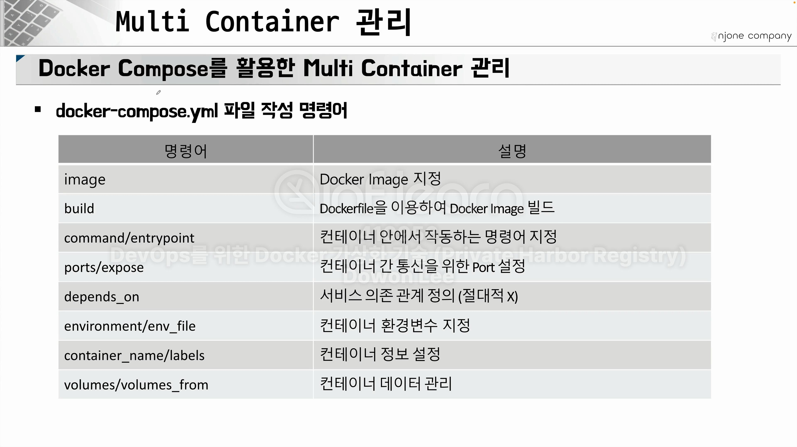
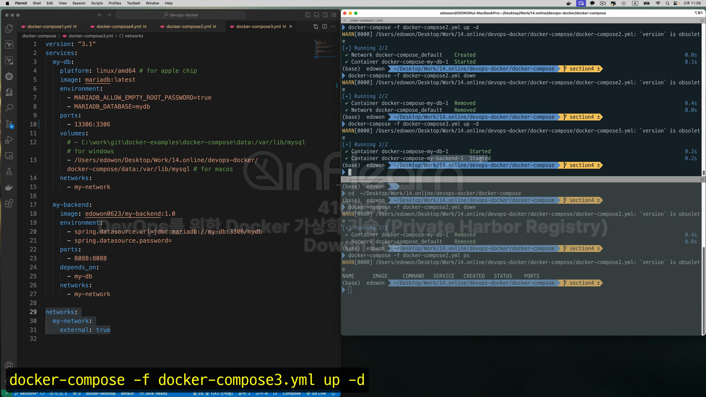
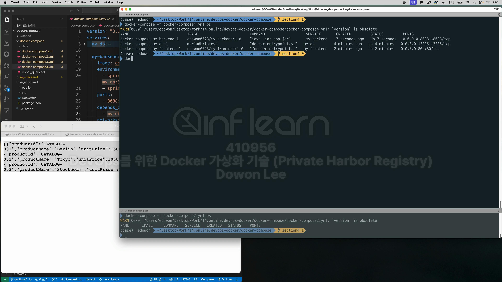

다양한 미들웨어들이 컨테이너 형태로 올라간다. <br>

또한 어플리케이션을 위한 각각의 비즈니스 로직들도 도커화 돼서 컨테이너로 올라간다. <br>
이러한 형태의 Architecture를 Microservices Architecture라고 한다. <br>
그리고 위에 있는 형태는 bizness logic과 관계없는 Infra적인 부분이고 우리는 이를 Outer Architecture라고 한다. <br> 
아래는 Inner Architecture라고 한다. <br>
그런데 이제 이런 컨테이너들이 수십개 수백개로 늘어나면 관리하는것에 어려움이 있다. 그래서 이걸 해결하고자 docker-compose를 사용한다. <br>

Continuous Integration: 통합 부분 <br>
Continuous Deployment/Delivery: 배포 부분 <br>
Orchestration Layer: 관리 부분 <br>

<br>
Continuous Integration: 개발자에의해 코드가 변경되거나 추가된다면 해당하는 코드는 그러한 코드를 중앙의 형상관리 시스템, 보통 git에 올리고 version<br>
관리를 하게 된다. <br>
그리고 소스 코드가 git repo에 모이게 되면, 그 코드를 이용해서 build를 하게된다. 그리고 빌드된 결과값들은 배포할 수 있는 형태로 만들어져야 하는데 <br>
binaries나 libraries 형태로 만들어져야 한다. 그리고 이러한 사이클은 한번으로 끝나지 않고 소스 코드가 변경되면 반복적으로 일어나게 되고 시스템의 품질을 올리게 된다.<br>
그렇기 때문에 Continuous Integration이라고 한다. <br>

Continuous Deployment/Delivery: CI를 통해서 빌드된 결과물들을 실제 운영 환경에 배포하는 것. <br>
배포를 하기 위해선 package들이 운영될 수 있는 환경을 갖추고 있어야한다. ex) Os, Middleware, DB 등 <br>
그런데 이런 운영체제들을 모두 구축하기 어렵기 때문에 우리는 가상화를 사용하고 그중에서도 Container 가상화를 사용하는 것이다. <br>
그럼 이제 packaing화 돼 있는 결과물을 container 가상화 기술에서 사용하기 위한 image로 만들어야 하는데 이 이미지를 만들기 위해 DSL을 사용하는 <br>
Dcokerfile을 활용하여 image를 만든다. 그런데 이때 우리가 packaging할 때 활용한 설정 정보들을 그대로 활용할 수 없는 경우가 있다. <br>
그래서 환경 설정 정보들을 따로 관리하는 경우가 일반적이다. 따라서 Dockerfile를 통해서 Image들을 만들고 환경 설정들을 참고해서 image를 만드는게 가장 이상적이다. <br>
이제 이러한 image들을 어디엔가 저장해 줘야 하는데 이러한 image들은 보통 registry에 저장한다. 이 작업 역시 Continuous하게 Delivery/Deployment가 이루어져야 한다. <br>
이러한 작업이 완료되면 image가 저장소에 들어가 있을 것이다. 이제 저장소에 있는 이미지들을 수십에서 수백개 단위로 관리하기 위해 Orchestration Layer를 사용한다. <br>
<br>
<br>


```shell
docker-compose up
#docker-compose 실행 명령어
#파일명이 없으면 docker-compose.yml을 기본으로 사용한다.
docker-compose -f docker-compose.yml up
#파일명을 지정하고 싶을 경우 이렇게 하면 된다. 
```
<br>
실습을 할 때 section-4 branch를 사용한다. section-4 branch는 docker-compose.yml이 있는 branch이다. <br>


가장 먼저 docker-compose1.yml을 실행해보자.<br>

```yml
version: "3.1"
# 가장먼저 services가 오고
services:
  # 그 다음에 container의 이름이 온다.  
  my-webserver:
    # 그리고 my-db라는 container가 가지고 있는 기능들을 기술하게 된다.
    platform: linux/amd64 # for apple chip
    image: nginx:latest
    ports:
      - 80:80
```
docker compose로 실행하기 전에 이 예제를 과거 docker로 어떻게 실행했는지 먼저 살펴보자. <br>
먼저 nginx 이미지가 있는지 확인해 보자. <br>


nginx를 실행해 보자. <br>
  
잘 실행이 된다! <br>
방금 실행한 nginx를 지우고 이번엔 compose 파일로 실행을 해보자. <br>
```shell
docker-compose -f docker-compose1.yml up 
```


docker-compose 명령어에서도 ps를 확인하는 명령어가 있다. <br>

그런데 docker-compose ps를 실행하기 위해서는 docker-compose가 실행되고 있는 디렉토리를 명시적으로 지정해 주어야 한다. <br>



  


<br>
코드로 실습을 해보자. <br>


제일 먼저 database먼저 실행을 해보자. 
나의 경우 13306 Port를 사용할 것이다. <br>
```yml
version: "3.1"
services:
  my-db:
    platform: linux/arm64 # for apple chip
    image: mariadb:latest
    environment: 
      - MARIADB_ALLOW_EMPTY_ROOT_PASSWORD=true
      - MARIADB_DATABASE=mydb
    ports:
      - 13306:3306
    volumes: 
      # - C:\work\git\docker-examples\docker-compose\data:/var/lib/mysql # for windows
      - /Users/sinsms/Desktop/workspace/docker_for_me/devops-docker/docker-compose/data:/var/lib/mysql # for macos
```
volumes에 /var/lib/mysql은 mariadb 컨테이너 내부에 데이터가 저장되는 공간이다. <br>
그리고 앞의 host pc의 경로는 내 경로에 맞게 수정해주었다. 윈도우 사용자라면 C:부터 시작해야한다. <br>


docker의 container와 network를 확인해보자. <br>

docker-compose_default 라는 네트워크가 생성된 것을 확인할 수 있다. <br>
그런데 지금 보면 <br> 

container는 docker-compose-my-db-1이라고 생성이 돼 있고, 네트워크는 docker-compose_default라고 생성이 돼 있다. <br>
이러한 설정은 현재 내가 작업하고 있는 Directory의 이름을 따서 생성이 된다. <br>
이걸 중지하고 이번엔 backend와 같이 실행해보자. <br>
docker-compose가 실행되는 위치로 이동한 후 
```shell
docker-compose -f docker-compose2.yml down
```


지금 돌아가는 ps가 없는것 확인. <br>


```shell
version: "3.1"
services:
  my-db:
    platform: linux/arm64 # for apple chip
    image: mariadb:latest
    environment: 
      - MARIADB_ALLOW_EMPTY_ROOT_PASSWORD=true
      - MARIADB_DATABASE=mydb
    ports:
      - 13306:3306
    volumes: 
      # - C:\work\git\docker-examples\docker-compose\data:/var/lib/mysql # for windows
      - /Users/sinsms/Desktop/workspace/docker_for_me/devops-docker/docker-compose/data:/var/lib/mysql # for macos
    networks:
      - my-network

  my-backend:
    image: edowon0623/my-backend:1.0
    environment: 
      - spring.datasource.url=jdbc:mariadb://my-db:3306/mydb
      - spring.datasource.password=
    ports:
      - 8088:8088
    depends_on:
      - my-db
    networks:
      - my-network

networks:
  my-network:
    external: true
#external 설정은 외부에 있는 network라는 의미이다. 
```

현재 my-network가 없다. my-network를 만들어주어야 한다. <br>


my-network를 만들어 주었다. 따라서 
```shell
networks:
  my-network:
    external: true
```
이 옵션도 오류없이 작동할 것이다. 

작동이 된다. <br>

```shell
docker-compose -f docker-compose3.yml ps
```

네트워크를 확인해보자. <br>


현재
```shell
docker-compose -f docker-compose3.yml up -d
#-d 옵션으로 docker를 띄었기 때문에 log를 확인할 수 없다. log를 확인하기 위해선 아래와 같은 명령어를 사용하면 된다.
docker-compose -f docker-compose3.yml logs
#그런데 logs의 뒤에 서비스의 이름을 입력하면 #해당 서비스의 log만 확인할 수 있다.
docker-compose -f docker-compose3.yml logs my-db
docker-compose -f docker-compose3.yml logs my-backend
```
서비스는 정상적으로 작동된다. <br>

localhost:8088/catalogs

```shell
docker-compose -f docker-compose3.yml down
```
도커를 모두 내리고 다시 network를 확인하면 연결 돼 있는 컨테이너가 모두 사라진것을 확인할 수 있다. <br>

docker-compose4를 실행해 보자. <br>

```shell
version: "3.1"
services:
  my-db:
    platform: linux/arm64 # for apple chip
    image: mariadb:latest
    environment: 
      - MARIADB_ALLOW_EMPTY_ROOT_PASSWORD=true
      - MARIADB_DATABASE=mydb
    ports:
      - 13306:3306
    volumes: 
      # - C:\work\git\docker-examples\docker-compose\data:/var/lib/mysql # for windows
      - /Users/sinsms/Desktop/workspace/docker_for_me/devops-docker/docker-compose/data:/var/lib/mysql # for macos
    networks:
      - my-network

  my-backend:
    image: edowon0623/my-backend:1.0
    environment: 
      - spring.datasource.url=jdbc:mariadb://my-db:13306/mydb
      - spring.datasource.password=
    ports:
      - 8088:8088
    depends_on:
      - my-db
    networks:
      - my-network

  my-frontend:
    image: edowon0623/my-frontend:1.0
    ports:
      - 80:80
    depends_on:
      - my-db
    networks:
      - my-network

networks:
  my-network:
    external: true
      
```
my-frontend가 추가됐다. <br>
이번에는 근데 조금 분리해서 실행시켜 보자. 
```shell
docker-compose -f docker-compose4.yml up -d my-db
```

이렇게 실행을 하면 my-db container만 작동하는 것을 확인할 수 있다.<br>
이렇게 하는 이유는 간혹가다가 my-backend가 my-db보다 먼저 실행이 되면서 my-db의 데이터를 못 읽어드리는 경우가 있기 때문이다. <br>
depends_on을 설정해 두었지만, 100% 보장이 되지 않아 이렇게 실행했다. <br>
```shell
docker-compose -f docker-compose4.yml ps
```

```shell
docker-compose -f docker-compose4.yml up -d
```

이렇게 나머지 2개만 실행이 된다. 


오류없이 잘 실행

만약 backend가 실행이 안된다면 <br>
```shell
docker-compose -f docker-compose4.yml stop my-backend
docker-compose -f docker-compose4.yml rm my-backend
docker-compose -f docker-compose4.yml up -d my-backend
```
이런식으로 backend만 내렸다가 다시 실행하면 된다. <br>


