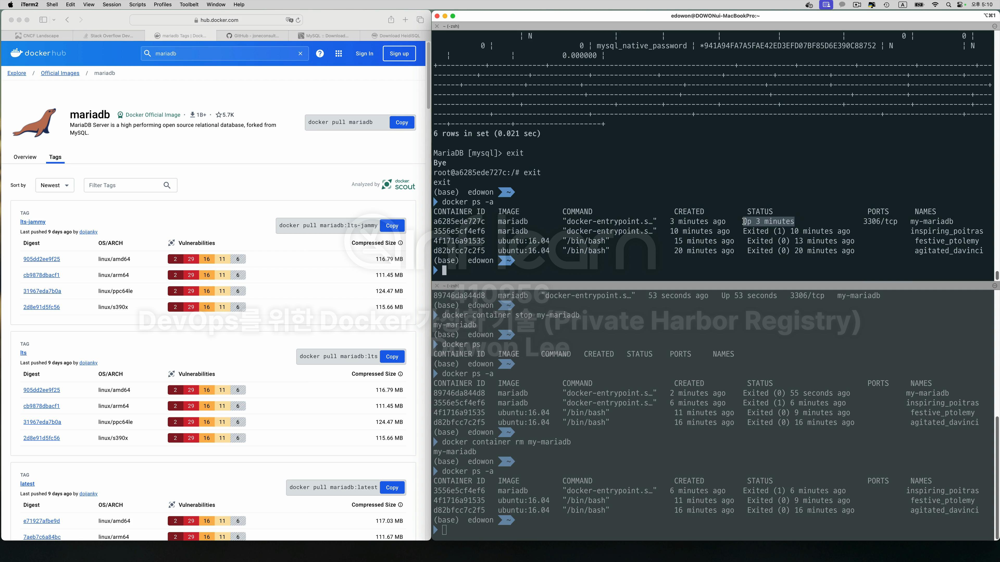
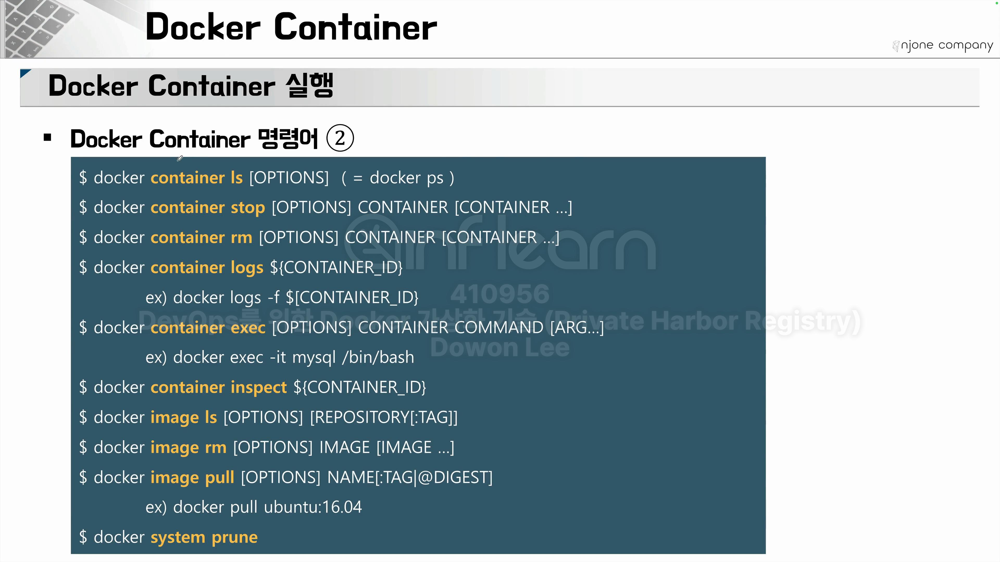

 


<br>
docker run은 create start 명령어를 포함한다. <br>
 <br>
실습해보자. <br>


```zsh
Pulling from library/ubuntu
```
library라는 계정에 가서 ubuntu라는 image를 다운로드 받고 있다. 기본적으로 왼쪽의 docker hub 사이트에 가서 <br>
다운로드 받는다. <br>

<br>
여기서 다운로드 받은것!
<br>
```bash
# mac
# 이 명령어를 사용하면 다운로드한 이미지를 확인할 수 있다.
docker images | grep ubuntu

# window
docker images | findStr ubuntu
```
<br>

```bash
# 실행중인 docker container를 확인하는 명령어
docker container ls

# 위와 똑같은 command로 아래가 있다.
docker ps
```
<br>


<br>
분명 위에서 run으로 실행시켰음에도 아무것도 안나온다. 그 이유는 docker는 container로 실행을 시켰을 때 process가 더이상 작동하지 않으면 종료한다.<br>

```bash
# 현재 running 상태의 container뿐만 아니라 중지 되어있는 container들도 보여주는 명령어
docker ps -a
```
<br>


<br>
그럼 이번엔 process를 유지하게 하자. <br>

```bash
# -it는 iteractive tty라고 해서 화면에 커맨드를 입력했을 때 해당하는 커맨드가 ubuntu라는 linux container에 전달되는 상태를 만드는 옵션이다.
docker run -it ubuntu:16.04
```


<br>
프롬포트가 바뀌었다. 컨테이너 아이디가 보인다. <br>

새로운 커멘더 창을 뛰오고 확인해보자. <br>


<br>
다시 원래 프롬포트 창으로 돌아가보자. <br>

```bash
#컨테니어 ID 확인
hostname
```


```bash
# 리눅스 시스템의 명령어 파일 조회
ls -al 

# 컨테이너 종료
exit
``` 


<br>

Database도 기동해보자 <br>
```bash
docker images | grep mariadb
```
<br> -> mariadb이라는 image없는것 확인 <br>

 

```bash
# mysql 설치
docker run -e MARIADB_ALLOW_EMPTY_ROOT_PASSWORD=true --name my-mariadb mariadb
```

밑에 ubuntu:16.04는 오타

<br>
근데 이렇게 띄우면 container log가 찍히는 상태라서 우리가 어떤 명령어를 입력할 수 없다. 이렇게 되면 다른 database의 명령어를 사용하기 위해서<br>
별도의 창을 또 열어여한다. <br>
일단 mariadb를 종료해보자. 보통 Ctrl+C로 종료가 되는데 database같이 process로 작동되는 middleware같은 경우에는 Ctrl+c로 종료가 안되는 경우가 있다.
<br>

```bash
docker container stop [컨테이너 네임]
```
<br>

그럴땐 이렇게 종료하다.
 
```bash
docker run -d -e MARIADB_ALLOW_EMPTY_ROOT_PASSWORD=true --name my-mariadb mariadb
```
<br>
-d, 즉, detach모드로 실행시켜 보자. 이 말은 지금 실행되고 있는 터미널과 분리해서 실행하라는 말이다. 즉 백그라운드에서 실행시키라는 말!<br>
이 명령어를 실행시키기 전에 docker ps -a에서 my-mariadb가 있는지 확인하고 완전히 삭제시키고 실행을 시키자! 있다면 아래 명령어 실행! <br>

```bash
docker container rm my-mariadb
```
<br>


<br>
확인. <br>
이제 container 내부에 접속해서 각종 명령어를 실행시켜보자 <br>

```bash
# bash를 컨테이너 안에 전달한다. bash 쉘이라는 process를 작동
docker container exec -it my-mariadb bash
```


<br>
프롬포트가 바뀐것을 확인 가능하다. <br>
이 상태는 컨테이너 내부에 접속해서 들어온 상태이다. 이 컨테이너는 mariadb라는 db이기 때문에 db에 client로 접속을 해보자.<br>

```bash
mariadb -h127.0.0.1 -uroot -p
```
<br>
처음에 db없이 접속 가능하게 설정햏기 때문에 Enter만 누르고 접속이 가능하다.


<br>
들어 가서 db에 관련된 명령어를 입력하여 확인하고 과정이 끝나면 exit를 통해 나올 수 있다.



<br>
detach모드롤 실행한 컨테이너는 아직도 작동중이다. <br>

```bash
docker container stop my-mariadb
```
로 컨테이너로 종료하자. 또 만약에 더이상 사용하지 않는다면 <br>
```bash
 docker container rm [container name]
```
<br>
명령어를 통해 삭제하자.
<br>




 


<br>
그럼 nginx를 먼저 한번 기동해보자. <br>

```bash
docker run nginx
```


<br>
localhost에는 접속할 수 없다. 이번엔 container의 내부로 접속해 보자. <br>

```bash
docker exec -it [container_id] bash
```


<br>
내부에 접속햇다. 이 상태에서 curl이라는 command를 사용해보자. <br>
curl은 터미널 상태에서 특정한 호스트에 접속해보고 우리가 필요로하는 api를 테스트해보는 테스트 도구이다. <br>


코드가 잘 동작하는것을 볼 수 있다. 위의 터미널에서도 호출된 이력이 잘 보인다. <br>
이 말은 container 내부에서는 nginx라는 서버가 잘 작동되고 있다. 그런데 외부에서는 호출이 안되는 상태이다! 이 말은 <br>
컨테이너 내부와 컨테이너 외부에 해당하는 host pc가 연결돼 있지 않다는 의미이다. <br>

<br>
다시 한번 기동해보자. 일단 다 위에 터미널에서 ctrl+c로 나오고 <br>


```bash
# host Pc에서 80으로 접속할 것이고 컨테이너 내부에서 80으로 응답할 것이다.
docker run -p 80:80 nginx
```

<br>
컨테이너 외부에서 응답이 된다. <br>
 


<br>
```bash
docker system prune
```
<br>
명령어를 사용하여 stop된 컨테이너와 사용되지 않은 network 그리고 불확실하게 사용된 images를 일괄적으로 삭제시키자.

<br>
-d으로 한번 실행시켜보자.
<br>


<br>
스탑 시키고 rm 시켜보자 근데 stop할때 id의 일부만 입력하면 id가 중복되지 않고 유니크할 시 그놈이 삭제된다. <br>


```bash
docker run --rm -d -p 80:80 nginx
```
이렇게 하면 컨테이너가 종료될 때 삭제된다.


<br>
파일 목록 확인
<br>


<br>
exit로 종료


```bash
# 13306으로 호출해서 3306(mariadb)로 받겠다.
docker run -d -e MARIADB_ALLOW_EMPTY_ROOT_PASSWORD=true -p 13306:3306 --name my-mariadb mariadb
```


```bash
cd devops-docker/my-node.js

# -v [host가 갖는 directory] : [container가 갖는 directory] 를 매핑해준다.
docker run -it -v ./:app -p 8000:8000 node:alpine sh
```


<br> 
-it라는 옵션 때문에 컨테이너 안으로 바로 접속해 있다. <br>


<br>
오류 발생! <br>

<br>
그 이유는 app.js라는 파일에서 express모듈 사용! <br>


<br>
근데 이렇게 컨테이너 pc에서 파일을 생성하고 변경하고 사용하는 모든 것들이 볼륨 마운트가 걸려있다면 호슽트 피씨에도 적용이 된다.<br>
확인해 볼까? <br>

<br>
컨테이너 내부에서 express라는 모듈을 설치했을 때 node_modules라던가 package-lock.json같은 파일이 생긴다. <br>
근데 그 내용이 <br>

<br>
호스트 pc에도 동일하게 적용이 돼있다. 


<br>
정상적으로 실행이 된다. <br>


<br> 이렇게 나오는 이유는 app.js를 열어보면 된다. 
 