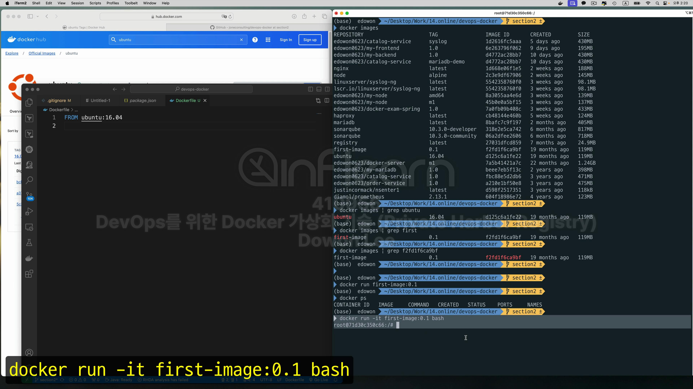
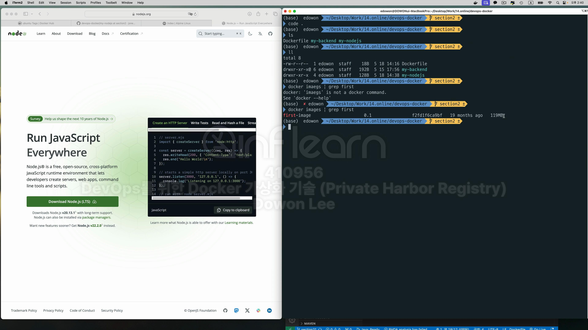
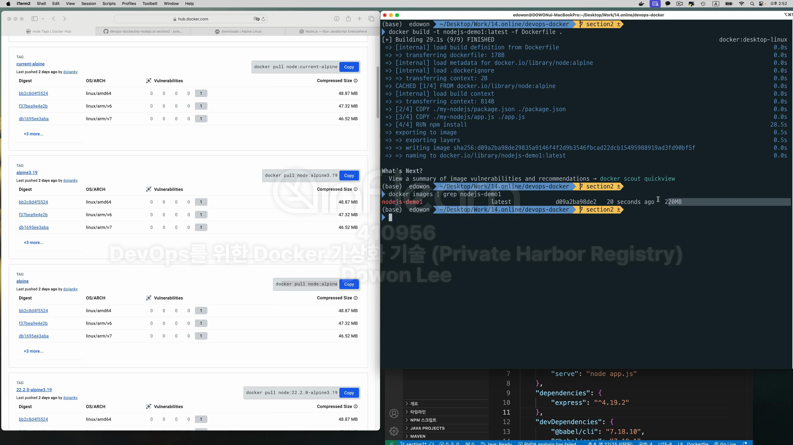

일단 section2로 체크아웃 한다.
<br>


어떤 base image를 쓸지 결정하기 전에 docker hub 사이트를 확인해 보자. <br>

<br>
이렇게만 하고 바로 build를 해보자.


```shell
# 현재 directory에 있는 Dockerfile을 사용할것이기 때문에 -f Dockerfile은 필요가 없으나 그래도 명시적으로 명시했다. 마지막의 .은 현재 위치를 표시
Docker build --tag first-image:0.1 -f Dockerfile .
```

```shell
#window
docker images | findStr ubuntu
```


```shell
docker run first-image:0.1
```
<br>
이렇게만 실행시키면 실행 됐다가 바로 종료 됨.
<br>


```shell
docker run -it first-image:0.1 bash
```
접속하려면 위 처럼 실행시키면 된다. 그럼 아래처럼 프롬포트가 바뀌고 컨테이너에 접속한것을 확인 가능하다. <br>


컨테이너의 러닝 상태를 확인 가능하다.


실습을 하기 전에 용량을 확인해 보자. 

119mb이다. 용량이 크다. 그래서 alpine-linux를 쓰자 <br>
alpine-linux는 경량화된 linux이다. <br>

docker hub에도 alpine 이미지가 있다.! <br>


RUN이라는 커멘드는 도커 이미지 내부에서 실행되고자 하는 어떤 실행절차이자 단계이다. <br>
설치가 다 끝났으면 CMD를 통해서 node를 실행시켜 주어야 한다. <br>
근데 왜 serve냐? 그 이유는 package.json 파일에 <br>
 <br>
script에 적혀있는 serve 명령어를 node 다음에 적어주면 우리가 필요한 파일을 실행시켜주는것! <br>
결국은 node.app.js를 실행시킨다는 의미이다. <br>
```dockerfile
#지금은 아래 처럼 작성 돼 있지만
CMD ["npm", "serve"]
#아래 처럼 작석해도 된다.
CMD ["node", "app.js"]
```


```dockerfile
RUN npm install
```
<br>
이 부분에서 오류가 발생! npm이라는 명령어가 없기 때문에 오류가 발생. npm이라는 명령어는 nodejs를 설치해야만 가능한 명령어 그런데 alpine에는 노드가 설치 <br
안되어있음. 따라서 이것을 설치 해야한다. <br>
그래서 <br>

```dockerfile
# 이 작업을 먼저 해주어야 한다. 
RUN "node js 설치"
# 이것을 하기 전에
RUN npm install

```
<br>
그런데 이 작업은 귀찮다. 그래서 node가 깔려있는 alpine을 가져오자! <br>

 
node도 역시 alpine 버전이 있다! <br>

```dockerfile
FROM node:alpine    
```
수정!


아까와 다른 오류가 발생! 이 오류는 무엇이냐 npm install 이라는 작업을 하기 위해서 package.json 파일 즉, node js의 폴더 구조에서 npm install이 <br>
실행되어야 하는데 지금 그 구조가 아니라는 말이다. <br>
그럼 우리가 nodejs 구조로 만들어주거나 아니면 우리의 package.json파일을 image 안으로 넣으면 된다. 



그럼 이제 이것을 실행시켜 보자. 
```shell
docker run nodejs-demo1:latest
```

Example app for CI/CD listening on port 8000이 출력되는 모습이 보인다. 저 메시지는 <br>

이곳에 설정돼 있다.
또 다른 터미널 창에서 확인해보면 container가 떠 있는게 보인다. <br>

이번엔 exec를 통해 컨테이너 내부에서 명령어를 실행시켜 보려고 했는데 에러가 난다. <br>

그 이유는 node:alpine에는 bash가 없다!
그럼 기본적인 shell인 sh로 실행하자. <br>

내부의 파일들을 확인해보자. <br>

node_modules라는 파일은 아까 말했듯이 npm install을 하면 생기는 파일이다. 근데 root에 이렇게 파일이 있는것은 옳치않다. 위치를 바꿔보자. <br>

docker stop으로 종료 이렇게 된 이유는 
```dockerfile
COPY ./my-nodejs/package.json ./package.json
COPY ./my-nodejs/app.js ./app.js
```
이렇게 root에 복사하게 했기 때문이다. 근데 이렇게 root에 하는것은 보안상이유로 좋지 않다.

그래서 우리는 WORKDIR를 지정해 주고 거기에 작업을 하겠다.로 바꿔준다. 

이미지를 확인해 보자. <br>


이번엔 port를 열어보자. <br>
```shell
docker run -p 8000:8000 --name my-node nodejs-demo1:v2.0
```
컨테이너 안에서는 8000으로 실행이 될테니 host pc에서 접속할 수 있게 8000으로 명시해주자. <br>

이제 확인해보면 PORTS에 우리가 명시한게 보인다. <br>


<br>
docker hub사이즈에서 registry라고 검색하면 된다. <br>


저기 보면 5000을 기본으로 사용한다. 근데 가끔 mac os는 5000을 사용중이라고 종종 뜬다.

확인하고 만약 저게 쓰고있는 포트가 있을시 airplay를 꺼준다. <br>


확인해보자 <br>


확인 끝 <br>
이제 nodejs로 되어있는 image들을 좀 확인하자 <br>

이 이미지를 local registry에 등록할 수 있는 형태로 변경한다음 사용해보자. <br>

실행하고 이미지를 다시 조회해보자 <br>

이미지 id가 동일하고 이름만 다른 이미지가 하나 더 생겼다 <br> 
이렇게 image id가 다르다는 의미는 아무것도 없는 image들은 docker.io/가 앞에 생략돼 있다는 의미이다. <br>
근데 이제 새로 생긴 image는 local registry로써 앞에 붙어있다. 만약 harbour라던가 aws를 쓴다면 거기에 맞게 태그명을 변경하면 된다.
<br>
이제 image를 push해 볼 것이다. 근데 nodejs-demo1를 push하면 docker hub의 내 계정으로 가는데 localhost:5000/nodejs-demo1을 push하면 <br>
로컬의 registry로 간다. <br>


이제 인터넷 창에서 확인해보면 들어와 있는것을 확인 가능하다. <br>

curl로 확인


docker hub에 로그인 해서 registry를 확인해보면, 내가 올린 image들을 확인할 수 있다. <br>

<br>
사용하는 방법은 간단하다. 일단, Create Repository를 클릭한다. 그리고 거기에 내가 저장할 repository 이름을 적어준다. <br>

그런데 repository를 만들고 push를 해야하냐? 그건 아니다. 내가 그냥 push를 하면 지정한 이름으로 repository를 생성한다. 그런데 순서는 원래 repository<br>
를 생성하고 만드는것이니 그렇게 만들도록 하자. <br>


```bash
docker push nodejs-demo1:v2.0
```
<br>
아무것도 입력하지 않은 상태에서 docker push를 하면 docker.io사이트로 즉, docker hub로 가게 된다. <br>


<br>
확인해보니 access denied라고 뜬다. <br>

이미지를 확인해보니 
```bash
[dockerio./library/nodejs-demo1]
```
이렇게 뜬다. library로 되어있다. 즉, 이것은 docker-hub에 마음대로 올릴 수 없다는 것이다. 나는 나의 계정에 올려야 한다. 나의 계정으로 올리자 <br>
```bash
docker tag nodejs-demo1:v2.0 [dockerid]/nodejs-demo1:v2.0
```
이렇게 해야한다. 먼저 계정명을 바꿔준것!

```bash
 docker tag nodejs-demo:v2.0 mongddangand/nodejs-demo1:v2.0 
```
나의 경우 이렇게 바꾸었다. <br>

이미지가 잘 만들어져있다. 이제 이것을 push해보자. <br>

만약 이 작업을 하기 전에 docker에 login하라는 표시가 뜬다면 아래 명령어를 실행한다. <br>
```bash
docker login
```

이미지가 업로드된 것을 확인할 수 있다. <br>
다른것도 올려보자. <br>


image 목록들을 모두 삭제해보자. <br>
```bash
docker rmi [imageID]
```

그런데 에러가 발생했다. 왜 그럴까? 사용하는 이미지의 ID들을 보니까 중복되는 것들이 있다. <br>
그럴 때는 강제로 삭제하는 방법이 있다. 하지만 그것보단 그럴 땐 이미지가 갖는 전체 이름과 태그명을 정확히 명시하면 삭제할 수 있다. 

그리고 강제로 삭제하는 방법도 있다. <br>
```bash
docker rmi -f [imageID]
```
이렇게 하면 두개가 한번에 삭제된다. 
이제 다시 다운받아보자.

