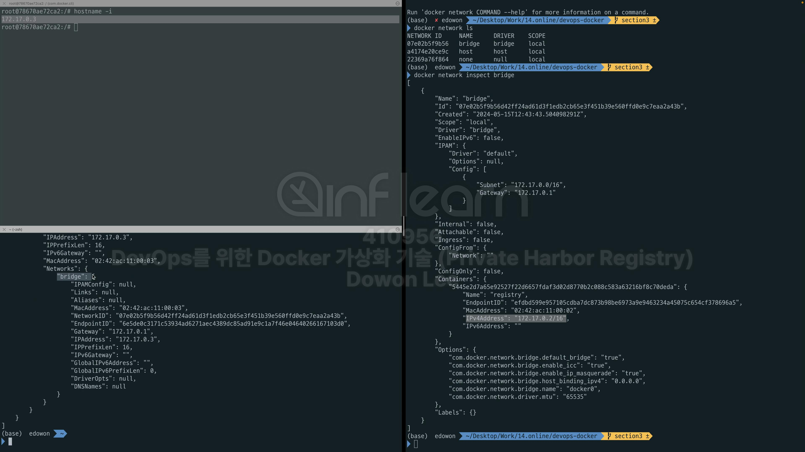
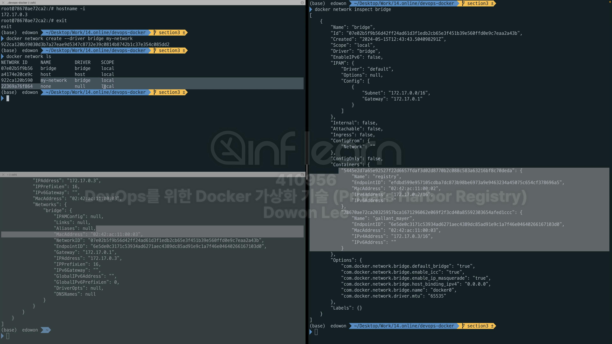
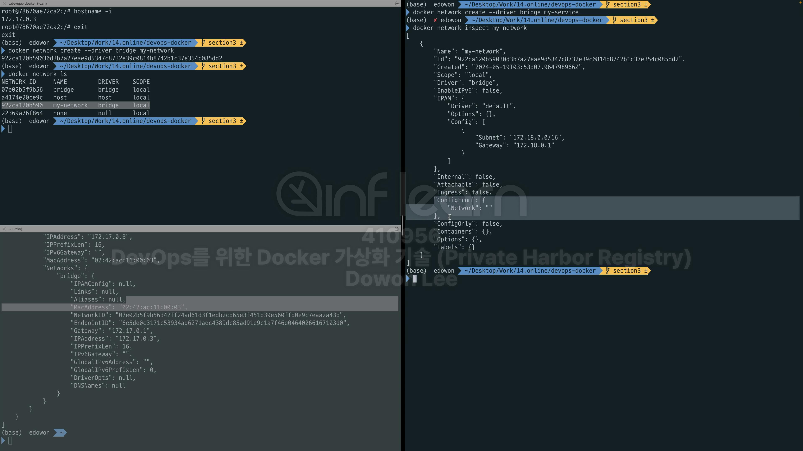
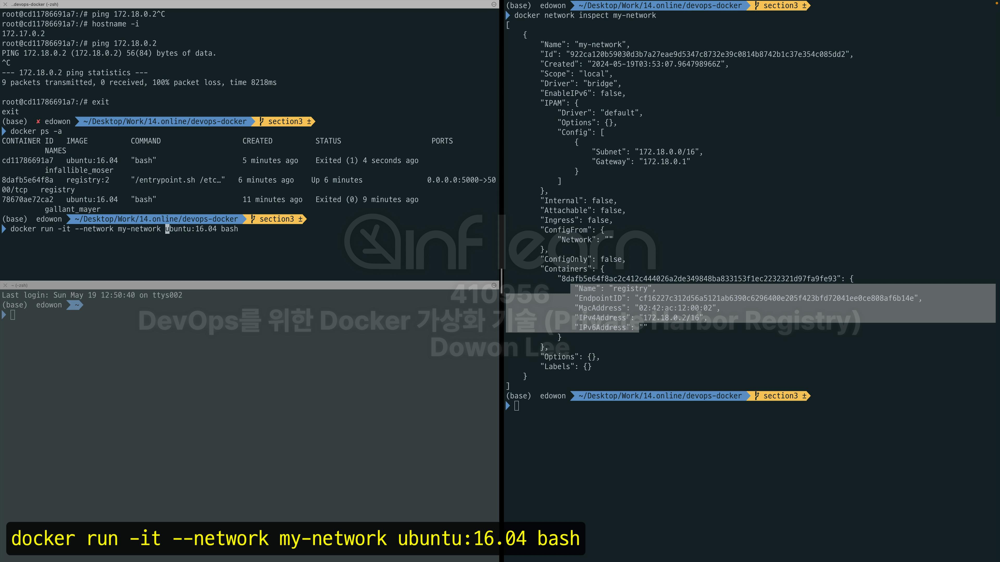
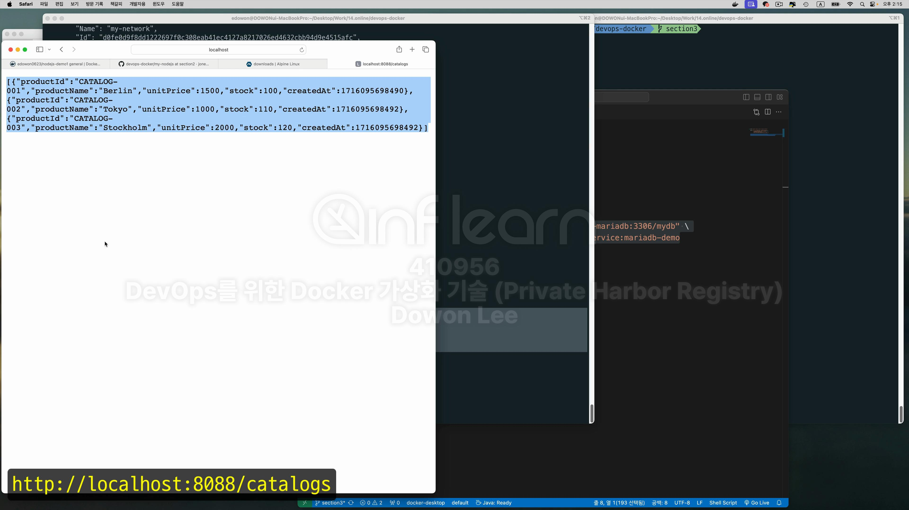
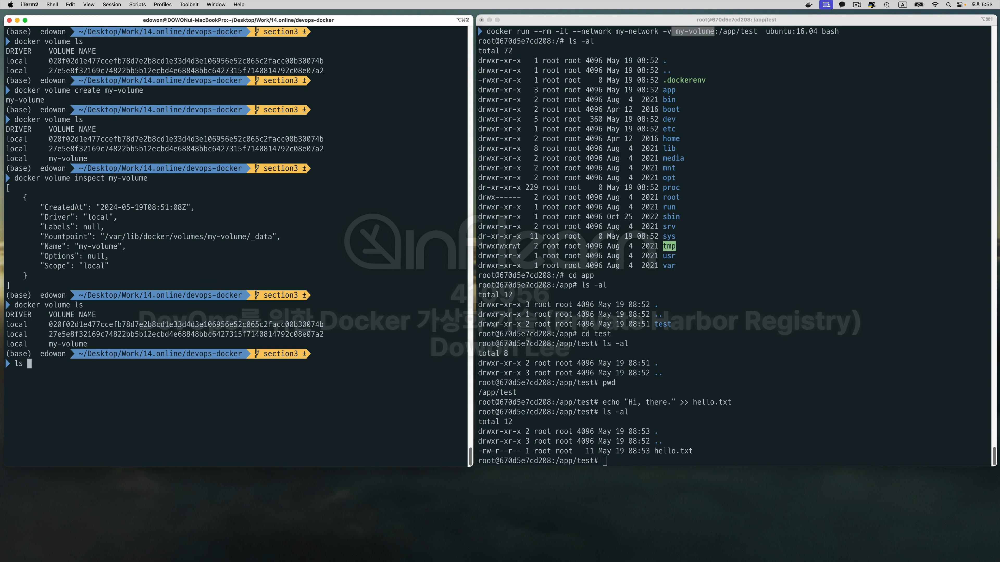

우리는 가정에서 인터넷 broadband를 이용해 인터넷을 사용한다. 회사도 마찬가지이다. <br>
그렇기 때문에 가정에서 사용하는 network와 회사에서 사용하는 network는 다르다. 그렇기때문에 서로간 통신을 할 수 없다.<br>
물론 외부에서 접속을 할 수 있게 게이트웨이나 방화벽을 사용해서 통신이 되거나 차단되게 할 수는 있다. <br>
하지만 원칙적으로 하나의 network와 다른 network는 통신이 불가능하다. <br>
그림을 보면 Host에 인터넷을 사용할 수 있게끔 ehh0(이더넷카드)가 연결 돼 있다. 보통은 wifi형태로 요새는 사용하지만 예전에는 랜케이블을 연결해서 사용했다. <br>
어쨋든 통신이 되어 있는 상태라는 것은, 그 해당하는 이더넷 카드에 고유한 IP Address를 받고 사용할 수 있는 상태라는 것이다. <br>
그리고 docker desktop을 설치했다는 것은 docker0라는 기본 network가 준비되어 있는 상태에서 이 network하고 host network가 연결돼 있는 상태이다. <br>
그리고 그 위로는 docker 가상화의 영역이다. <br>
그리고 컨테이너가 떠 있다는 것은 독립적인 이더넷 카드를 가지고 독립적인 network가 떠있는 상태라는 의미이다. <br>
가상의 컨테이너 환경이기 때문에 veth가 떠있다. <br>
이더넷 카드가 하나씩 떠 있다는 것은 IP Address가 하나씩 할당돼 있다는 의미이다. <br>
그런데 그런 IP Adress는 다른 쪽과 연결 돼 있지 않는다. 그런데 이더넷 카드를 가지고 있는 상태에서 외부와 어떤 포트 연결이 돼 있지 않더라도 루프백 아이디 <br>
(127.0.0.1) or (localhost)로는 통신이 가능하다. 이게 lo로 표현이 돼 있는 것이다. <br>


 


현재 떠 있는 process를 확인해보자 registry가 하나 떠 있따. <br>
이번에는
```shell
docker network ls
```
를 통해서 network를 확인해보자. <br>
 
<br>
기동 돼 있는 컨테이너의 상세 정보를 보자. <br>
```shell
docker container inspect [Container ID]
```
<br>


제일 상단에 실제 id를 확인할 수 있다. <br>

그리고 마지막에 networks가 있다. 그리고 지금 현재 이건 bridge network에 속해 있다. <br>
이번엔 docker network를 살펴보자. 
```shell
docker network inspect [Network ID]
```


정보를 보면 Containers가 보인다 여기엔 이 network에 속해 있는 컨테이너들이 보인다. <br>
여기를 보면 name이 "registry"로 되어 있다. 이건 container의 이름이 맞다. <br>

network도 똑같은것을 확인할 수 있다. <br>
컨테이너를 하나 더 띄어보자. <br>
```shell
docker run -it ubuntu:16.04 bash
```

현재 접속한 ubuntu의 hostname을 확인해보자. <br>

현재 실행중인 컨테이너 목록을 확인해보자. <br>

방금 실행한 ubuntu 컨테이너가 보인다. <br>
ubuntu 컨테이너를 자세히 살펴보자. <br>
```shell
docker container inspect [Container ID]
```

실행 시키면 정보가 쭉 조회된다. 제일 마지막 부분만 확인해보자. <br>

bridge network에 속해 있다. <br>
그럼 이제 다시 network를 확인해보자. <br>
```shell
docker network inspect [Network ID]
```

컨테이너가 2개 들어가있는것을 확인할 수 있다. <br>

2번째 컨테이너는 이름을 지정하지 않아서 랜덤한 Name으로 들어가있지만, 확인할 수 있다. <br>
bridge network에 정보를 추가할 때마다 정보가 추가된다. <br>
이제 network에 추가해보고 확인해 봤으니까 network를 하나 만들어보자. 우선 exit으로 ubuntu에서 나가자. <br>

네트워크를 하나 만들어 보자. <br>
```shell
#bridge라는 옵션을 부여할 수 있는데 이 옵션을 부여하지 않으면 기본적으로 bridge network가 만들어진다.
docker network create --driver bridge my-network
```

새로 생긴 my-network를 확인할 수 있다. 다시 한번 상세보기를 해보자. <br>

현재 포함 돼 있는 컨테이너가 아무것도 없다. <br>
그리고 이 컨테이너의 subnet 마스크를 확인해보면 172.18.0.0부터 시작한다고 나와있다. 이 말은 내가 만약 my-network를 쓰겠다는 것은 172.18로 시작하는 <br>
network 대역대를 쓰겠다는 의미이다. <br>
다시 한번 container 환경을 확인해 보자. <br>

이 상황에서 registry를 삭제해보자.  <br>


이제 떠 있는 컨테이너는 ubuntu밖에 없다. <br>
이제 다시 registry를 다시 실행시켜보자. <br>


만약 기존의 방식으로 아래와 같이 실행을 한다면, 
```shell
docker run [container ID]
```
이렇게 실행을 한다면, 아무런 network 옵션이 없기 때문에 기본 network에 들어가게 된다. <br>
그런데 기본 network에 들어가는 대신에 
```shell
docker run -d -p 5000:5000 --restart always --network my-network --name registry registry:2
```
이렇게 network 옵션을 지정해주면 지금 기동하는 containter를 my-network에 넣겠다는 의미이다. <br>
실행을 시키고 다시 한번 확인해보자. <br>
```shell
docker ps -a
docker inspect [Container ID]
```

docker가 현재 my-network에 들어가 있는것을 확인할 수 있다. <br>
그리고 IPAddress를 확인해보자. 172.18.0.2이다 이것은 방금 my-network를 확인했을 때 본 subnet의 주소(172.18.0.0)과 유사하다. <br>
근데 my-network의 subnet 아래를 보니 "Gateway"에 172.18.0.1이 할당돼 있는 것을 볼 수있다. 그래서 +1이 돼서 registry에 172.18.0.2가 할당된 <br>
것이다.<br>
이번에 다시 한번 my-network를 확인해보자. <br>
```shell
docker network inspect my-network
```

아까는 컨테이너 영역이 비어있었지만, 지금은 registry가 들어가 있는 것을 확인할 수 있다. <br>
자, 그런데 마약 이 컨테이너말고 다른 컨테이너 즉, ubuntu라는 컨테이너를 실행할 때, 
```shell
docker run -it utuntu:16.04 bash
```
이렇게 기동했다고 해보자. <br>

지금이 컨테이너는 network 옵션을 부여하지 않았다. 그렇기 때문에 이 컨테이너의 ip 대역대는 172.17로 돼 있다. <br>

이건 기본적으로 docker가 제공하는 bridge network에 속해 있다. <br>
그렇기 때문에 my-network에 속해 있는 registry와는 통신이 불가능하다. <br>
그래도 한번 테스트해보자.  <br>

근데 현재 ping이라는 명령어를 사용할 수 없다. <br>
따라서 일단 먼저 Package를 설치해보자. <br>
```shell
apt update
apt install iputils-ping
```
다시 ping을 날려보았지만 아무런 응답이 없다. <br>

network가 연결이 되지 않은 상태인것을 알 수 있다. <br>
이것을 이제 어떻게 해결할 것인가. 우선을 종료해보자. <br>

종료한 상태에서 컨테이너의 목록을 보자. <br>

Exited 상태이기 때문에 중지가 된 것을 알 수 있다. <br>
다시 한번 컨테이너를 실행시켜보자. <br>
```shell
docker run -it --network my-network ubuntu:16.04 bash
```

다시 한번 network의 ip를 확인해보자. <br>

!!짜짠!! 172.18.03가 할당된 것을 확인할 수 있다. <br>
번외로 linux에서 ipadress확인할 때 보통 ifconfig라고 입력하면 정보가 표시되는데 여기서는 ifconfig가 없는 ubuntu를 쓰고 있어서 hostname -i를 쓰고 있다. <br>
근데 ipconfig쓸려면 아까처럼 설치하면 됨
<br>
아무튼, 지금 컨테이너의 ipaddress확인했고 network에 돌아가서 확인해보면! <br>

Containers 부분에 또 하나 들어와있는것을 확인할 수 있다. <br>
이상태에서 다시 한번 Ping을 날려보자. <br>
```shell
apt update
apt install iputils-ping
ping 172.18.0.2
```

잘 동작하는것을 확인할 수 있다. <br>
이 말은 ubuntu에서 registry로 통신이 가능하다는 것이다. <br>
이번에는 기동할 때 network를 부여하는것 말고 이미 기동된 container에 network를 부여해보자. <br>
```shell
docker run -d -p 8000:8000 --name my-node mongddangand/nodejs-demo1:v2.0
```

실행이 되었다. 정보를 확인해보자. <br>
```shell
docker inspect my-node
```

이 놈은 bridge network에 속해있다. <br>
이놈은 172.18과 다른 대역대이기 때문에 my-network에 속해 있는 registry와 통신이 불가능하다. <br>
그래서 이놈을 my-network에 넣어보자. <br>
```shell
docker network connect my-network my-node
```

```shell
docker inspect my-node
```

network 정보가 2개 나오는것을 확인할 수 있다. <br>
```shell
docker network inspect my-network
```

container가 3개 들어가있는 것을 확인 가능한다. <br>

 
실습에 앞서 network와 container를 정리하고 시작하자. <br>
```shell
docker system prune
```

다시 확인해보니 my-node와 registry가 남아있다. <br>
요놈들도 삭제하자. <br>

prune 옵션을 확인해보면 <br>
1. all stoped containers 
2. all networks not used by at least one container  
3. all dangling images
4. unused build cache
<br>
이제 database를 기동해보자. <br>
근데 명령어가 길다면 그 전에 입력했던 기록들 중에서 mariadb를 찾아보면 된다. <br>
```shell
history | grep mariadb
```
```shell
#-d는 detache mode이고 -p는 portforwarding (컨테이너 내부는 3306으로 기동이 되고 host에서 접속하려면 13306으로 접속해야하한다.) 
docker run -d -p 13306:3306 -e MARIADB_ALLOW_EMPTY_ROOT_PASSWORD=true --name mariadb1 mariadb:latest
```

확인해보면 PORTS에 13306에서 3306으로 포트포워딩이 돼 있는 것을 확인할 수 있다. <br>
이번엔 workbench를 기동해보자. <br>

localhost:13306으로 접속을 해보자. <br>

이렇게 MARIADB에 접속된 것을 확인할 수 있다. <br>

두번째로 이제 host pc에 설치 돼 있는 tomcat에서 MARIADB를 사용해보자. <br>
우선 기존의 MARIADB(mariadb1)를 삭제해보자. <br>
```shell
docker stop mariadb1
docker rm mariadb1
```
이번엔 section3의 코드를 사용할 것인데 간단하게 section3의 코드를 살펴보자. <br>
database를 기동할 수 있는 명령어가 docker_command.sh에 들어가 있다. <br>


실행이 되었다. <br>
이번에는 my-backend에 가보면 Dockerfile이 있고 간단한 코드가 들어가 있다. <br>
application.properties를 확인해해보자. <br>

server의 port와 datasource의 url, username, password가 있다. <br>
이제 자바에서 저 db의 정보를 잘 가져오는지 확인해 보자. <br>

일단 my-backend까지 접근해보자. <br>
여기로 오면 catalog-service-mariadb-1.0.jar가 있다. <br>
만약 없다면 이 jar를 생성하면 된다. 생성하는 방법은 maven을 설치한 상태에서 
```shell
mvn clean compile package
```
를 입력하면 된다. <br>
근데 이미 있으니까 이건 건너뛰고 이 jar를 실행하기 위해선 자바가 깔려있어야 한다. 깔려있는것 확인<br> 

자바가 깔려있으니까 이제 jar를 실행해보자. <br>
```shell
java -jar catalog-service-mariadb-1.0.jar
```

 
잘 실행됐고 db를 다시 확인해보면 기존에 업었던 catalog가 새로 생긴것을 확인할 수 있다.


catalog의 세가지를 확인할 수 있다. <br>


실습에 필요한 코드는 section3에 docker_command.sh를 참조하면 된다. <br>

실습을 시작하기 전에 우선 network부터 확인해보자. <br>

내 경우엔 없다.
```shell
docker network create --driver bridge my-network
```

생성을 했으면 바로 inspect 때려보자. <br>
```shell
docker network inspect my-network
```

보니까 ip 대역대가 172.19로 설정이 돼 있다. <br>
이번에는 database를 기동해 보자. <br>
이번엔 database를 기동해 볼것인데 
```shell
docker run -d -p 13306:3306 --network my-network \
        -e MARIADB_ALLOW_EMPTY_ROOT_PASSWORD=true \
        -e MARIADB_DATABASE=mydb \
        --name my-mariadb edowon0623/my-mariadb:1.0
```
이걸 실행하기에 앞서  edowon0623/my-mariadb:1.0 이 이미지 먼저 땡겨와 보자. <br>

이미지를 가져왔다. 또 
```shell
docker run -d -p 8088:8088 --network my-network \
        -e "spring.datasource.url=jdbc:mariadb://my-mariadb:3306/mydb" \
        --name catalog-service edowon0623/catalog-service:mariadb-demo

```
이번엔 docker_command.sh의 3번째 명령어인 edowon0623/catalog-service:mariadb-demo이걸 가져와 보자. <br>


이미지들을 잘 가져온것을 확인할 수 있다. <br>
이제 command들을 실행해보자. <br>


ipaddress도 172.19.0.2로 할당 돼 있고 Name도 my-mariadb로 잘 할당이 돼 있다. <br>


2개를 띄었고 2개는 같은 네트워크에 묶인다. <br>

Containers에 2개를 확인할 수 있다. <br>


<br>
<br>
<br>
<br>
<br>


```shell
docker volume ls - 목록 확인
docker volume rm [Volume ID] - 삭제
```

docker volume을 테스트해보기 전에 프로세스 상태를 확인해보자. <br>
 
이번엔 volume의 목록들을 확인해보자. <br>

작업중인 container는 2개밖에 없는데 volume의 목록은 5개가 있다. <br>
docker의 volume을 삭제하자. <br>

현재 컨테이너에서 사용중인 volume은 에러가 난다. 이건 우리가 띄운 컨테이너의 볼륨이다. 컨테이너를 삭제하고 볼륨을 삭제하면 된다. <br>
근데 먼저 container를 inspect해보자. <br>


여러가지 내용 중 중간에 mount가 보인다. 마운트라는것은 실제 사용되고 있는 storage라던지 어떠한 장비가 우리가 쓰고자 하는 linux 시스템에서 어떻게 연결 <br>
되는지 나타내는 부분이다. <br>
볼륨도 가상의 저장소이고 그러한 볼륨이 mount 형태로써 컨테이너 내부와 호스트pc를 연결하고 있다라고 보면 된다. <br>
volume의 이름이 020~인데 왼쪽의 volume에 보이는 이름과 같다. 그리고 "Destination"을 보면 /var/lib/mysql로 컨테이너 내부에서는 사용되고 있다. <br>
"Source"는 host pc에서 볼륨을 사용하고 있는 경로이다.(컨테이너 외부의 장소) <br>
다시 process를 보자. 

아래있는 container가 database관련 container이다. 그리고 왼쪽 창의 위쪽에 있는 volume이 아래 있는 database와 연결된 volume이다. <br>
다음번에 그럼 my-mariadb가 기동됨에 있어서 왼쪽창의 위의 volume을 연결시켜 준다면 volume의 데이터를 계속 my-mariadb가 사용할 수 있다. <br>
이번엔 spring-boot container를 확인해보자. <br>


spring boot의 volume mount는 name이 27e4e~로 돼 있다. 이것은 왼쪽에 있는 2번째 volume이랑 연결 돼 있다는 의미이다.<br>

```shell
docker run -it --network my-network ubuntu:16.04 bash
```
<br>
이것을 실행시켜 보자.<br>


근데 지금 실행시킨 이 ubuntu의 volume은 어떻게 연결 돼 있을까? 옆에서 확인해 보자. <br>


Mounts가 비어있는 것을 확인할 수 있다. <br>
이것을 연결하는것은 얼마든지 가능하다. <br>


일단 ubuntu에서 나오고 ubuntu를 삭제하자. <br>
volume을 하나 만든다. <br>
```shell
docker volume create my-volume
```

```shell
docker volume inspect my-volume
```


다시 한번 컨테이너를 기동할 것인데 이번에는 --rm 옵션을 주어 container가 stop 상태가 되면 자동으로 rm이 되도록 옵션을 부여한다. <br>
그리고 volume 정보 또한 지정해 주자. <br>
```shell
docker run --rm -it --network my-network --volume my-volume:/app/test ubuntu:16.04 bash
# --volume은 -v로 축약 가능
```

파일 목록으로 app과 app/test가 만들어진것을 확인할 수 있다. <br>


현재 app/test에는 아무런 파일이 없다. 그래서 그 안으로 들어가서 "Hi, there"는 문장이 hello.txt라는 파일에 들어가게 해보자. <br>

그런데 지금 작업한 이러한 작업은 my-volume과 연결이 되어있다!! <br>

그런데 이 volume이 위치하는 경로는 /var/lib/docker/volumes/my-volume/_data에 위치한다. <br>
이 위치가 정말 존재하는지 검색해보자. <br>
```shell
ls -al /var/lib/docker/volumes/my-volume/_data
```

디렉토리를 발견할 수 없다. 이 이유는 dockerdesktop을 사용하면 이 위치로 직접 접근할 수 없기 때문이다. <br>
linux 사용자만 가능. 그래서 다른 방식으로 사용해야함. 그래서 지금 기억할 것은 my-volume안에 hello.txt가 생성 돼 있다는것을 알면 된다. <br>
container를 종료해보자. <br>


실행 옵션 자체가 --rm이기 때문에 종료가 되면 자동으로 삭제가 된다. <br>
이번엔 같은 컨테이너를 실행할 것인데 volume mount옵션을 지정하지 않고 실행해보자. <br>
```shell
docker run --rm -it --network my-network ubuntu:16.04 bash
```

volume mount 옵션을 실행하지 않았기
때문에 app이라는 directory가 생성되지 않는다. <br>
exit로 나오고 이번에는 volume mount 옵션을 부여한 상태에서 컨테이너를 실행해보자. <br>
```shell
docker run --rm -it --network my-network --volume my-volume:/app/test ubuntu:16.04 bash
```


hello.txt가 있는 것을 확인할 수 있다. 이 말은 이전의 데이터를 확인할 수 있다는 것이다. host에 연결해 줌으로써 데이터를 영속적으로 사용할 수 있다.<br>

<br>
<br>
이번에는 컨테이너와 볼륨을 연결할 때, 특정한 volume mount를 지정하는 것이 아니라 host에 있는 directory를 찍어서 연결해 보자. <br>\


현재 기동중인 컨테이너는 하나 밖에 없다. <br>
```shell
docker run --rm -it --network my-network -v ./docker_volume_test:/app/test ubuntu:16.04 bash
# .으로 하면 현재 directory를 의미한다. 그러니까 즉, 현재 위치에서 /docker_volume_test라는 directory를 찍어서 연결하겠다는 의미이다. <br>
```
그런데 이걸 실행하기 전에 현재 디렉토리 위치와 현재 디렉토리에 들어있는 포함 돼 있는 directory를 확인한다. <br>
현재 directory에 docker_volume_test가 있으면 삭제하자. <br>
```shell
pwd
ls -al
rm -rf docker_volume_test
```

이렇게 할 때 만약 docker_volume_test가 존재하지 않는다면 docker_volume_test라는 directory를 자동으로 생성한다. <br>
ubuntu안에서 app/test에 들어가보자. <br>

그럼 여기에 파일을 만들고 host pc와 연결 돼 있는지 확인해보자. <br>


이건 host pc에 적용된 파일도 컨테이너에 적용됨. <br>
volume mount를 함으로써 현재 컨테이너를 삭제하고 새로운 컨테이너를 실행시킬 때 host pc에 있는 directory를 찍어서 연결해주면 <br>
데이터를 영속적으로 사용할 수 있다. <br>

<br>
그런데 만약 이 상태에서 database를 새롭게 시작해본다고 가정해보자. <br>

```shell
docker run -d -p 8088:8088 --network my-network \
        -e "spring.datasource.url=jdbc:mariadb://my-mariadb:3306/mydb" \
        --name my-mariadb edowon0623/my-mariadb:1.0
```


```shell
docker inspect [Container ID]
```


띄운 컨테이너의 Mounts를 확인해보면 <br>

"Name"에 새로운 volume이 생성된 것을 확인할 수 있다. <br>

그리고 volume의 list를 확인해보면 새로운 volume이 생성된 것을 확인할 수 있다. <br>
이렇게 되면 기존 데이터를 사용할 수 없다! <br>
그렇기 때문에 볼륨을 유지시키기 위해선 volume mount를 통해 데이터를 유지시기키는 작업이 필요하다. <br>

```shell
docker volume rm [Volume ID]
docker stop [Container ID]
docker rm [Container ID]
```
새로 생긴 볼륨을 삭제하고 실행중인 container를 삭제한 후에 <br>
```shell
docker run -d -p 13306:3306 --network my-network \
        -v [기존의 volume ID]:/var/lib/mysql \
        -e MARIADB_ALLOW_EMPTY_ROOT_PASSWORD=true \
        -e MARIADB_DATABASE=mydb \
        --name my-mariadb \
        edowon0623/my-mariadb:1.0
```

실행 시키면 기존의 volume을 사용하게 된다. <br>


